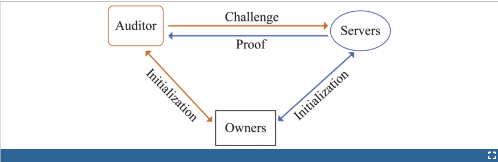
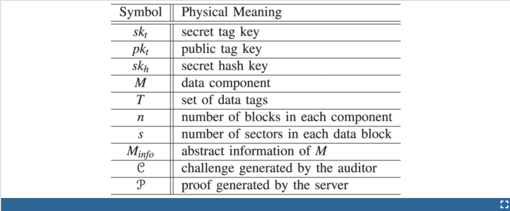

# An Efficient and Secure Dynamic Auditing Protocol for Data Storage in Cloud Computing

[论文地址](https://ieeexplore.ieee.org/abstract/document/6311398)

以下是论文 **"An Efficient and Secure Dynamic Auditing Protocol for Data Storage in Cloud Computing"** 的总结：

---

### **背景**
随着云计算的普及，数据所有者将数据存储在云端，并允许数据消费者远程访问。然而，这种数据外包模式引入了新的安全挑战，例如如何确保数据在云端被正确、安全地存储。传统的远程数据完整性验证方法大多针对静态数据，无法满足云存储中动态数据操作的需求。

---

### **研究问题**
1. 如何在云环境中高效地验证数据的完整性。
2. 如何支持动态数据操作（如插入、修改和删除）。
3. 如何保护数据隐私并支持多用户场景（如批量审计）。

---

### **主要贡献**
1. **审计框架设计**
   提出了一个高效的云存储审计框架，旨在保护数据完整性，并确保数据在云中的安全存储。

2. **隐私保护的审计协议**
   提出了一种高效且隐私保护的动态审计协议，使用随机预言机模型来证明其安全性。
   - 数据隐私通过隐藏敏感信息避免泄露。
   - 动态操作（插入、删除、修改）高效且支持云端处理。

3. **支持批量审计**
   扩展了协议以支持多个数据所有者和多个云存储提供商的批量审计，无需可信的第三方组织者。

4. **优化审计性能**
   通过设计，显著减少了审计方（独立第三方）的计算和通信开销，使其适合大规模云存储环境。

---

### **技术实现**
- 利用分块技术和加密算法提高审计效率。
- 支持动态数据操作的完整性验证，通过轻量级操作维护数据一致性。
- 使用分组签名和哈希技术实现多用户和多云环境的批量验证。

---

### **实验与分析**
1. **安全性**
   在随机预言机模型下，证明了协议的安全性，能够抵抗云服务器的恶意行为和数据泄露风险。

2. **性能**
   实验表明，与现有方法相比，提出的协议在计算开销、通信成本和存储消耗方面具有显著优势。

---

### **结论**
论文提出的动态审计协议：
- 高效、安全、支持隐私保护；
- 能够处理动态数据操作；
- 适合多用户和多云的批量审计场景。

该协议为云存储系统的安全性和效率提供了一种切实可行的解决方案，为云存储技术的进一步发展奠定了基础。

## Abstract

在云计算中，数据所有者将其数据托管在云服务器上，用户（数据消费者）可以从云服务器访问数据。然而，由于数据外包，这种新的数据托管服务模式也引入了新的安全挑战，这需要一个独立的审计服务来检查云中数据的完整性。一些现有的远程完整性检查方法只能用于静态存档数据，因此无法应用于审计服务，因为云中的数据可能会被动态更新。因此，需要一种高效且安全的动态审计协议来让数据所有者确信其数据在云中得到了正确存储。

在本文中，我们首先为云存储系统设计了一个审计框架，并提出了一种高效且隐私保护的审计协议。随后，我们将审计协议扩展以支持数据的动态操作，该协议在随机预言机模型中是高效且可证明安全的。我们进一步扩展了审计协议，使其支持针对多所有者和多云的批量审计，无需使用任何可信的组织者。分析和模拟结果表明，我们提出的审计协议是安全且高效的，尤其是在减少审计方的计算成本方面表现突出。

## 1.Introduction

云存储是云计算的一项重要服务 [1]，它允许数据所有者 (所有者) 将数据从其本地计算系统移动到云中。越来越多的所有者开始将数据存储在云中 [2]。然而，这种新的数据托管服务模式也带来了新的安全挑战 [3]。所有者会担心数据会在云中丢失。这是因为数据丢失可能发生在任何基础设施中，无论云服务提供商采取多么可靠的措施 [4]，[5]，[6]，[7]，[8]。有时，云服务提供商可能会不诚实。他们可能会丢弃未访问或很少访问的数据以节省存储空间，并声称数据仍然正确地存储在云中。因此，所有者需要确信数据正确地存储在云中。

传统上，所有者可以基于双方存储审计协议检查数据完整性[9]，[10]，[11]，[12]，[13]，[14]，[15]，[16]，[17]。然而，在云存储系统中，让云服务提供商或所有者任何一方进行这样的审计都是不合适的，因为他们都不能保证提供公正的审计结果。在这种情况下，第三方审计是云计算存储审计的自然选择。具有专业知识和能力的第三方审计员（审计员）可以更高效地完成工作，并让云服务提供商和所有者都信服。

对于云存储系统中的第三方审计，一些先前的研究[18]，[19]提出了几个重要的要求。审计协议应具有以下属性：1）**机密性**。审计协议应将所有者的数据保密，不让审计员知道。2）**动态审计**。审计协议应支持云中数据的动态更新。3）**批量审计**。审计协议还应能够支持多个所有者和多个云的批量审计。

最近，提出了几种远程完整​​性检查协议，允许审计员检查远程服务器上的数据完整性[20]，[21]，[22]，[23]，[24]，[25]，[26]，[27]，[28]。表1给出了一些现有的远程完整性检查方案在性能、隐私保护、动态操作支持和多所有者和多云批量审计方面的比较。从表1中我们可以发现，许多方案不具备**隐私保护**或不支持**数据动态操作**，因此无法应用于云存储系统。

23 24 25 26的缺点是什么：

    在 [23] 中，作者提出了一种动态审计协议，可以支持云服务器上数据的动态操作，但该方法可能会将数据内容泄露给审计员，因为它需要服务器将数据块的线性组合发送给审计员。在 [24] 中，作者扩展了他们的动态审计方案以保护隐私，并支持多个所有者的批量审计。然而，由于数据标签数量庞大，他们的审计协议可能会给服务器带来巨大的存储开销。在 [25] 中，Zhu 等人提出了一种合作的可证明数据持有方案，可以支持多云的批量审计，并在 [26] 中将其扩展为支持动态审计。然而，他们的方案不能支持多个所有者的批量审计。这是因为每个所有者使用的数据标签生成参数不同，因此，他们无法将来自多个所有者的数据标签组合起来进行批量审计。另一个缺点是，他们的方案需要额外的可信组织者在多云批量审计期间向审计员发送承诺，因为他们的方案应用了掩码技术来确保数据隐私。然而，这种额外的组织者在云存储系统中并不实用。此外，无论是Wang方案还是Zhu方案，都会增加审计者的计算成本，使得审计者成为性能瓶颈。

本文内容 ：

本文提出了一个高效、安全的动态审计协议，可以满足上述要求。为了解决数据隐私问题，我们的方法是利用双线性对的双线性性质生成带有挑战戳的加密证明，使得审计者无法解密但可以验证证明的正确性。由于不使用掩码技术，我们的方法在对多个云进行批量审计时不需要任何可信组织者。另一方面，在我们的方法中，我们让服务器计算证明作为验证的中间值，这样审计者可以直接使用这个中间值来验证证明的正确性。因此，我们的方法可以通过将审计者的计算负担转移到云服务器上，大大减轻审计者的计算负担。

1. 我们设计了一个云存储系统的审计框架，并提出了一个隐私保护且高效的存储审计协议。我们的审计协议通过使用密码方法和双线性对的双线性特性来确保数据隐私，而不是使用掩码技术。我们的审计协议减少了审计员和服务器之间的通信成本。它还通过将审计员移至服务器来减少审计员的计算负载。
2. 我们扩展了我们的审计协议以支持数据动态操作，这在随机预言模型中是高效且可证明安全的。
3. 我们进一步扩展了我们的审计协议，以支持不仅针对多个云而且针对多个所有者的批量审计。我们的多云批量审计不需要任何额外的可信组织者。多所有者批量审计可以大大提高审计性能，尤其是在大规模云存储系统中。

本文的其余部分安排如下：第 2 节中，我们描述了系统模型和安全模型的定义。第 3 节中，我们提出了一种高效且固有安全的审计协议，并对其进行了扩展，以支持第 4 节中的动态审计。第 5 节中，我们进一步扩展了我们的审计协议，以支持针对多个所有者和多个云的批量审计。第 6 节从通信成本和计算成本的角度分析了我们提出的审计协议的性能。安全性证明将在补充文件中显示，该文件可在计算机协会数字图书馆 http://doi.ieeecomputersociety.org/10.1109/TPDS.2012.278 上找到。第 7 节中，我们给出了有关存储审计的相关工作。最后，第 8 节给出了结论。

## 2.Preliminaries and Definitions  准备工作和定义
本节首先描述系统模型，给出存储审计协议的定义，然后定义存储审计系统的威胁模型和安全模型。

### 2.1 Definition of a System Model
我们考虑一个如图 1 所示的云存储审计系统，该系统涉及数据所有者（所有者）、云服务器（服务器）和第三方审计员（审计员）。所有者创建数据并将其数据托管在云中。云服务器存储所有者的数据并向用户（数据消费者）提供数据访问权限。审计员是一个值得信赖的第三方，具有为所有者和服务器提供数据存储审计服务的专业知识和能力。审计员可以是政府管理的值得信赖的组织，可以为数据所有者和云服务器提供公正的审计结果。

在描述审计协议定义之前，我们首先定义一些符号，如表2所示。

定义1：（存储审计协议）。存储审计协议由以下五个算法组成：
1. KeyGen（λ）→（skh，skt，pkt）。该密钥生成算法除了隐式安全参数λ之外不需要其他输入。它输出一个秘密哈希密钥skh和一对秘密-公共标签密钥（skt，pkt）。
2. TagGen（M，skt，skh）→T。标签生成算法将加密文件M，秘密标签密钥skt和秘密哈希密钥skh作为输入。对于每个数据块mi，它根据skh和skt计算数据标签ti。它输出一组数据标签T = {ti}i∈[1，n]。
3. Chall（Minfo）→C。挑战算法将数据Minfo的抽象信息（例如，文件标识，总块数，版本号，时间戳等）作为输入。它输出挑战C。
4. Prove（M，T，C）→P。证明算法以文件 M、标签 T 和审计员 C 的质询作为输入，输出证明 P。
5. 验证（C、P、skh、pkt、Minfo）→0/1。验证算法以服务器的 P、秘密哈希密钥 skh、公共标签密钥 pkt 和数据摘要信息 Minfo 作为输入，输出审计结果为 0 或 1。

### 2.2 安全模型的定义
我们假设审计员是诚实的，但又充满好奇心。审计员在整个审计过程中都表现得诚实，但对收到的数据感到好奇。但服务器可能不诚实，并可能发起以下攻击：
1. 替换攻击。当服务器已经丢弃 mi 或 ti 时，服务器可能会选择另一对有效且未损坏的数据块和数据标签 (mk,tk) 来替换受到质疑的数据块和数据标签 (mi,ti)。
2. 伪造攻击。如果所有者的秘密标签密钥被重复用于不同版本的数据，服务器可能会伪造数据块的数据标签并欺骗审计员。
3. 重放攻击。服务器可能会从先前的证明或其他信息生成证明，而无需检索实际所有者的数据。

##  3. Efficient and Privacy-Preserving Auditing Protocol 高效且保护隐私的审计协议
在本节中，我们首先介绍我们在设计高效且隐私保护的审计协议时应用的一些技术。然后，我们描述针对云存储系统的审计协议的算法和详细构造。正确性证明将显示在可在线获取的补充文件中。
### 3.1 解决方案概述
数据存储审计协议设计的主要挑战是数据隐私问题（即审计协议应保护审计员的数据隐私）。这是因为：1）对于公开数据，审计员可以通过从数据证明中恢复数据块来获取数据信息。2）对于加密数据，审计员可以通过任何特殊渠道以某种方式获取内容密钥，并能够解密数据。为了解决数据隐私问题，我们的方法是利用双线性对的双线性性质生成带有挑战戳的加密证明，这样审计员就无法解密它，但审计员可以在不解密的情况下验证证明的正确性。

虽然审计员有足够的专业知识和能力来开展审计服务，但审计员的计算能力不如云服务器强。由于审计员需要为许多云服务器和大量数据所有者进行审计，因此审计员可能是性能瓶颈。在我们的方法中，我们让服务器计算证明作为验证的中间值（由挑战戳和数据块的线性组合计算得出），这样审计人员就可以使用这个中间值来验证证明。因此，我们的方法可以通过将审计人员转移到云服务器来大大减少他们的计算负担。

为了提高审计系统的性能，我们在方法中应用了数据片段技术和同态可验证标签。数据片段技术可以减少数据标签的数量，从而减少存储开销并提高系统性能。通过使用同态可验证标签，无论有多少个数据块受到挑战，服务器只向审计人员响应数据块的总和与标签的乘积，其大小是恒定的，并且仅等于一个数据块。因此，它降低了通信成本。

### 3.2 审计协议算法 先略过

## 7 Related Work

为了支持动态审计，Ateniese 等人 [29] 开发了一种基于加密哈希函数和对称密钥加密的动态可证明数据持有协议。他们的想法是在设置期间预先计算一定数量的元数据，以便更新和挑战的次数是有限的，并且是预先固定的。在他们的协议中，每次更新操作都需要重新创建所有剩余的元数据，这对于大文件来说是个问题。此外，他们的协议无法在任何地方执行块插入（只允许附加类型的插入）。Erway 等人 [22] 还扩展了 PDP 模型以支持对存储数据的动态更新，并提出了两种动态可证明数据持有方案，使用基于等级信息的新版本的认证字典。然而，他们的方案可能会给服务器带来沉重的计算负担，因为它们依赖于 Ateniese 提出的 PDP 方案。

在 [23] 中，作者提出了一个动态审计协议，可以支持云服务器上数据的动态操作，但是该方法可能会将数据内容泄露给审计员，因为它需要服务器将数据块的线性组合发送给审计员。在 [24] 中，作者扩展了他们的动态审计方案以保护隐私，并支持对多个所有者的批量审计。然而，由于数据标签数量庞大，他们的审计协议会给服务器带来沉重的存储开销。在 [25] 中，朱等人提出了一种合作的可证明数据持有性方案，可以支持对多个云的批量审计，并在 [26] 中对其进行了扩展以支持动态审计。然而，他们的方案不可能支持对多个所有者的批量审计。这是因为每个所有者使用的数据标签生成参数不同，因此他们无法将来自多个所有者的数据标签组合起来进行批量审计。另一个缺点是，他们的方案需要额外的可信组织者在对多个云进行批量审计时向审计者发送承诺，因为他们的方案采用了掩码技术来确保数据隐私。然而，这种额外的组织者在云存储系统中并不实用。此外，无论是王的方案还是朱的方案，都会给审计者带来巨大的计算成本，这使得审计系统效率低下。

## 8 Conclusion

